## REQUISITOS DEL SISTEMA

Dentro del archivo README del repositorio en realidad no hay un apartado exacto donde se identifique los requisitos necesarios para ejecutar el proyecto, pero a primera vista en la sección “Running the reference API” se pueden ver comandos que indican que se debe utilizar Docker, y muy probablemente un SGBD (pgAdmin, el candidato para esta ocasión).

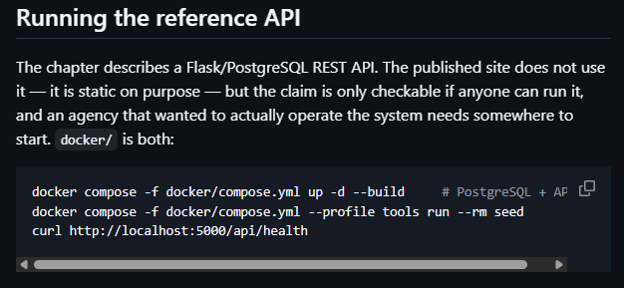

Dado estas suposiciones, se necesita estrictamente:
- Tener instalado Docker desktop
- Un SGBD, en este caso pgAdmin

Una vez teniendo estos programas instalados los ejecutamos y los mantenemos abiertos, nos colocamos en la carpeta donde esta almacenado el repositorio (previamente clonado en local) mediante la terminal del equipo.

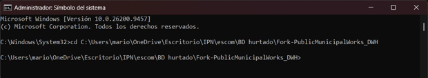

Como medidas de precaución se rectificó que en Docker no hubiera ningún contenedor en uso o inicializado, quedando totalmente sin contenedores activos.

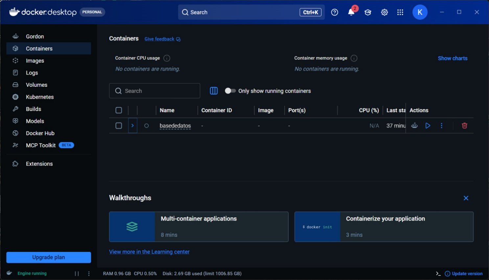

---
## PASOS PARA PONER EN FUNCIONAMIENTO EL PROYECTO

Ejecutamos el primer comando, el comando de arranque siguiente:
```bash
docker compose -f docker/compose.yml up -d --build
```
Este se encargará de construir las imágenes y contenedores declarados en el compose.yml
Veremos rápidamente como se comienzan a construir los contenedores y descargar todo lo necesario (declarado en el archivo compose.yml).

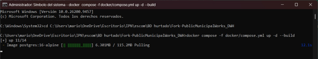
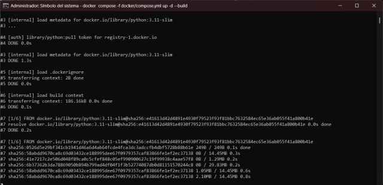
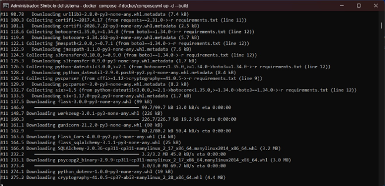

Una vez terminado el proceso (que puede durar varios minutos la primera vez), la terminal se ve de la siguiente forma:

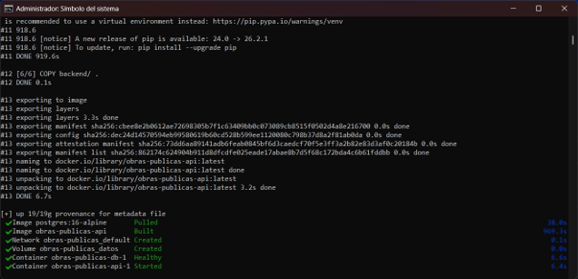

En la aplicación Docker también deberíamos de ver los contenedores funcionando:

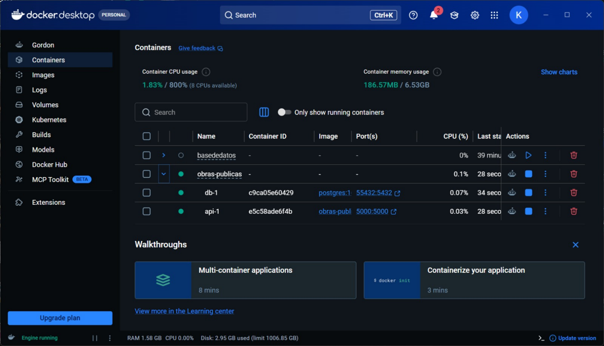

Ejecutamos nuestro segundo comando:
```bash
docker compose -f docker/compose.yml --profile tools run --rm seed
```
Este será el encargado de demostrar que el contendor seed ejecuto los scripts de Python para llenar el Data Warehouse (almacén de datos) con datos sintéticos.

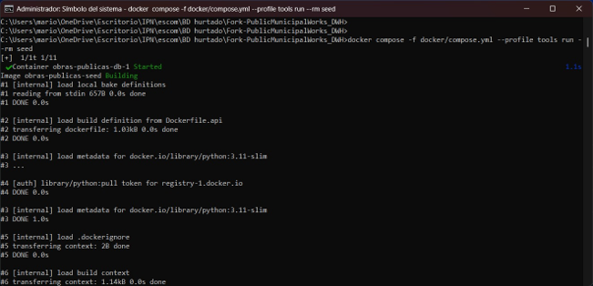
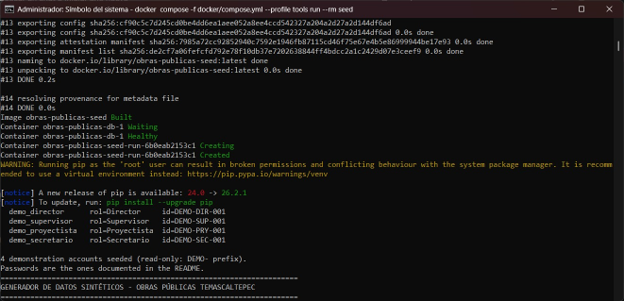
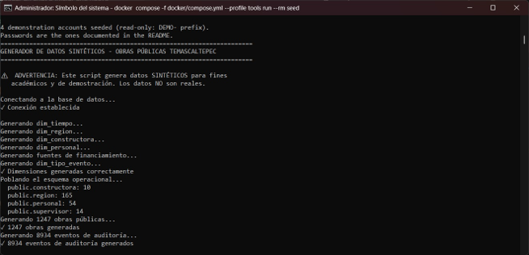

Una vez terminado el proceso veremos lo siguiente (el comando se ejecutó correctamente):

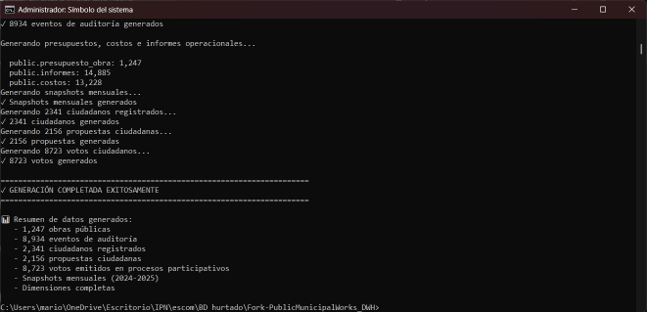

## EVIDENCIA DEL FUNCIONAMIENTO LOCAL
Para evidenciar ejecutamos el siguiente comando en terminal
```bash
curl http://localhost:5000/api/health
```
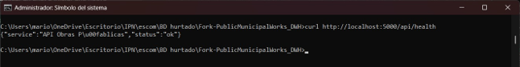

---
## CONECTARSE A LA BASE DE DATOS A TRAVES DE PGADMIN

Consultamos el archivo compose.yml ubicado en la ruta docker/compose.yml

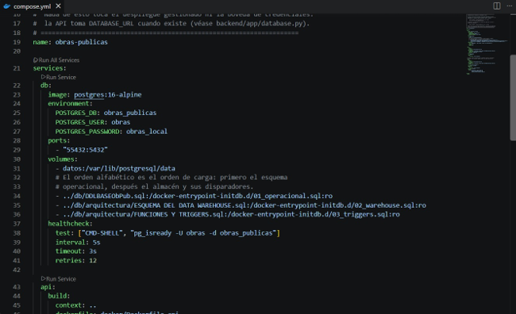

Localizamos el puerto, usuario y contraseña y nombre de base de datos ubicada en el apartado de servicios en db, siendo los siguientes:
- DB: obras_publicas
- USER: obras
- PASSWORD: obras_local
- PORTS: 55432:5432
Con estos datos hacemos la conexión con la base de datos

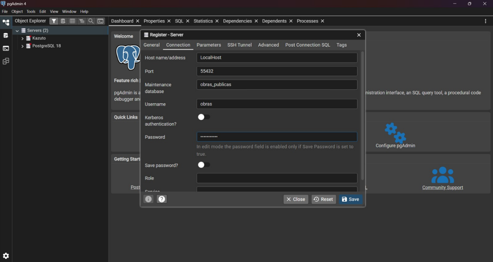

Con el servidor de la base de datos ya conectado:

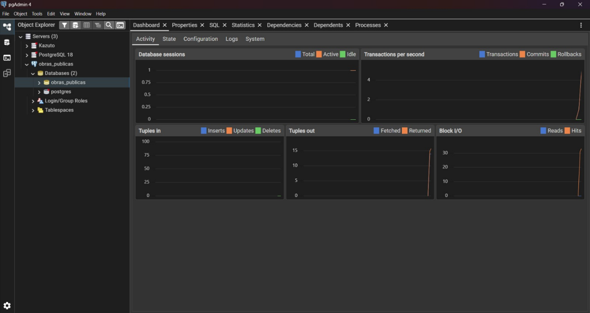


---
## EVIDENCIA DE USO LOCAL (INTERFAZ GRAFICA DEL PROYECTO)
Para este apartado debemos tener insalatada alguna version de python, se puede hacer desde la Microsoft Store, una vez instalado se abre una nueva terminal en la carpeta que se menciona adelante.
Abrimos los archivos web que vienen incluidos en el repositorio, ya que el contenedor de Docker que esta funcionando se encarga exclusivamente de la base de datos y la API (el backend). Según el README.md, toda la interfaz visual (el frontend) está contenida dentro de la carpeta docs/index.html
Comunmente los navegadores habituales bloquean los scritps de JavaScript por seguridad. Por lo que abriremos ese archivo index mediante una funcion de python usando la terminal:
```bash
python -m http.server 8000
```
Despues de ejecutar el comando en terminal entramos a la direccion que planteamos "http://localhost:8000" en el navegador y deberia verse tal cual estaba planeado:

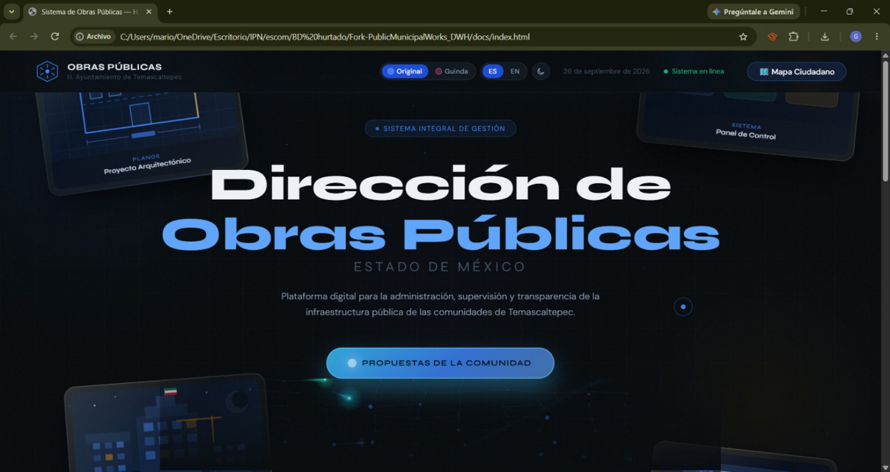
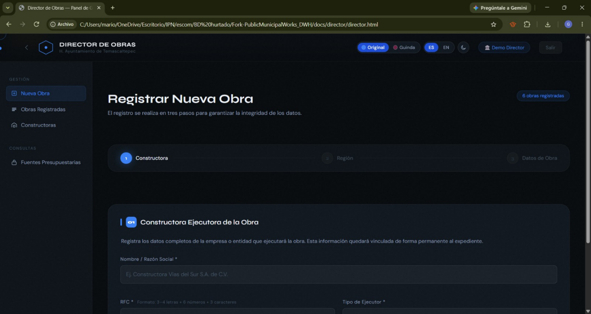

---
## CONSULTAS EN LA BASE DE DATOS

Una vez conectado pgAdmin a el proyecto abrimos el query tool.

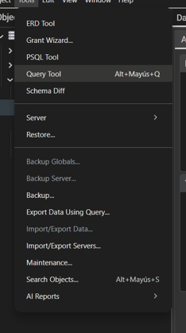

Debido a que en el archivo README del proyecto en el apartado “Data Model” dice que el Data Warehouse está estructurado en 10 diemensiones (guarda datos descriptivos del modelo relacional) , 2 tablas de hechos (almacenan las métricas y eventos clave) y 6 vistas (relaciones complejas resultas) cada tipo con sus nombres y atributos correspondientes. En el apartado “Checking the repository against the paper” se indica la ruta exacta de los archivos donde está el codigo SQL que construye las tablas. (db/arquitectura/ESQUEMA DEL DATA WAREHOUSE.sql)

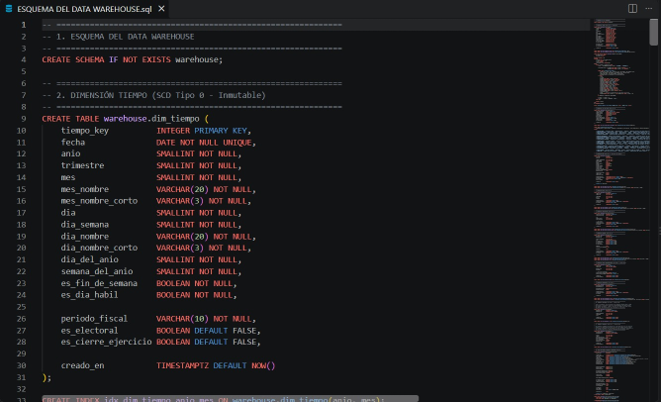

Aclarado lo anterior entonces podemos ejecutar las siguientes consultas:
- 1. Consultar una tabla de hechos (Fact Table)
```sql
SELECT obra_key, tiempo_key, avance_fisico_acumulado, porcentaje_ejercido
FROM warehouse.fact_obra_mensual
LIMIT 15;
```
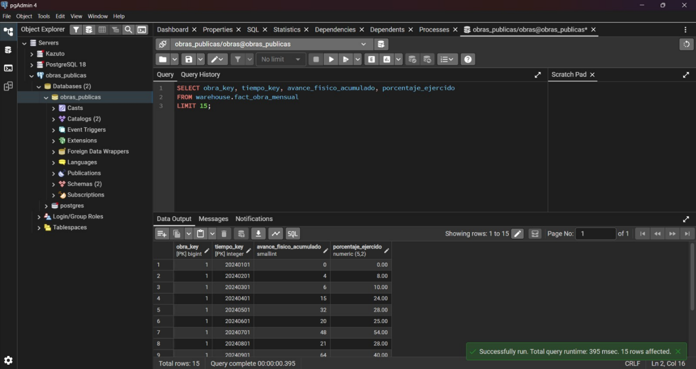

- 2. Consultar una tabla de dimensión (Dimension Table)
```sql
SELECT obra_id, nombre_obra, etapa_nombre, estado_nombre
FROM warehouse.dim_obra
WHERE es_actual = TRUE
LIMIT 15;
```
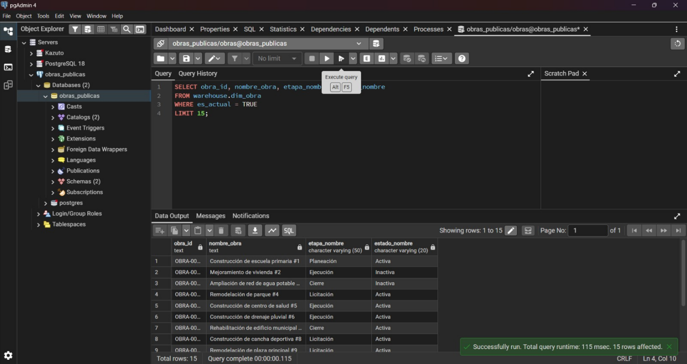

- 3. Consultar una vista analítica (View)
```sql
SELECT evento_key, tiempo_key, descripcion_evento, monto_ejercido, usuario_db
FROM warehouse.fact_eventos_auditoria
LIMIT 15;
```
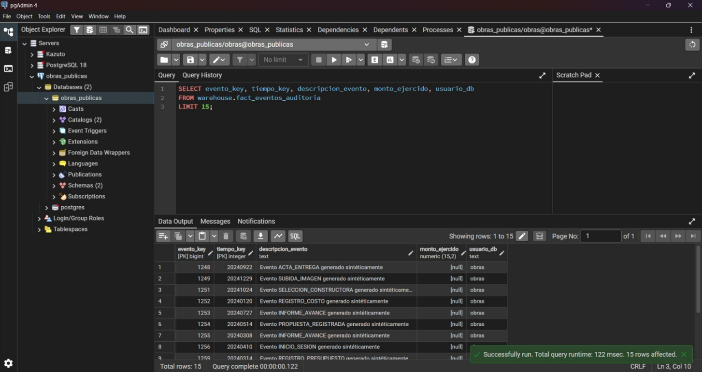
